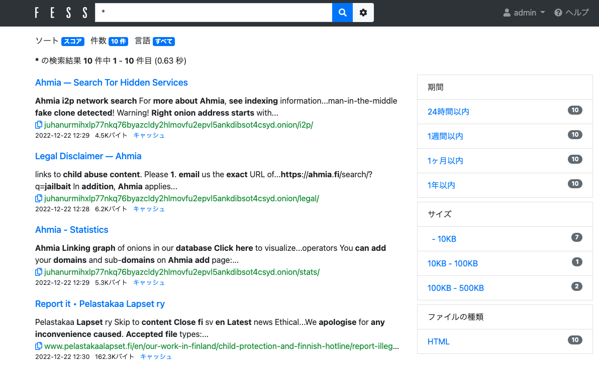

# Dark Fess
TorにDockerコンテナ内のブラウザからアクセスするための環境です。  
Fessを使うことで特定のサイトをクローリングして自分だけのダークウェブ検索エンジンを構築できます。  

## セットアップ
必要なツールをインストールします
```
$ sudo apt update 
$ sudo apt install docker-compose docker.io
```

Dockerグループに追加してから再起動します。
```
$ sudo usermod -aG docker ${USER}
$ reboot
```

最新のDockerイメージをダウンロードします。
```
$ git clone https://github.com/phishing-hunter/dark-fess
$ cd dark-fess
$ docker-compose pull
```

## コンテナの起動
```
$ docker-compose up -d
```

## 使い方
dockerを実行しているホストから「http://127.0.0.1:8000 」へアクセスします。  
VNCのパスワード(default: password)を入力すると、Dockerコンテナ内のUbuntuへ接続できます。  
コンテナ内のFirefoxを起動するとTorを経由してインターネットに接続ができます。  

## クローラーの設定
vncのubuntuからfirefoxを起動し「http://fess:8080 」へアクセスします。(admin/admin)  
管理画面から「{role}admin-api」のパーミッションを設定したアクセストークンを作成します。  
続いてvnc内のターミナルを起動し以下の環境変数に設定します。  
```
$ export TOKEN="アクセストークン"
```
次に以下のスクリプトを使ってクローラを登録することでTorを経由したクローリングを実行することができます。
```
$ /scripts/add_url.sh 'http://juhanurmihxlp77nkq76byazcldy2hlmovfu2epvl5ankdibsot4csyd.onion/search/?q=leaked'
```



## 参考
* [アクセストークン作成](https://news.mynavi.jp/techplus/article/techp4514/)
* [Fess における proxy 設定で軽くハマったメモ](https://qiita.com/KentoDodo/items/70af54c9806932e4a61a)
* [Dockerを使ってPrivoxy＋Torの環境を一瞬で作る](https://qiita.com/Shigai/items/1bc9c8476798ccaec403)
